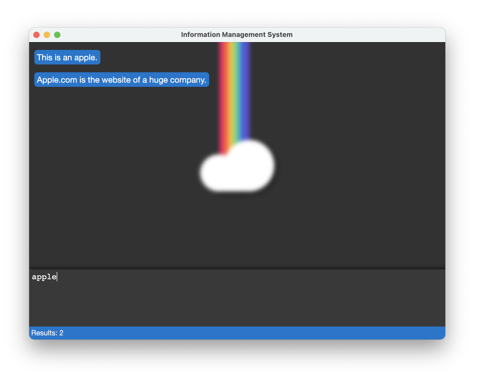

# The Information Management System

[](https://GitHub.com/b3z/reventlou/releases/)
[](https://github.com/b3z/reventlou/issues)
[](https://github.com/b3z/reventlou/stargazers)

> This tool is so simple that most people don't understand how to use it.

#### TL;DR

This is a personal database which stores all type of things. Text, Files, Links. Stored things can be searched. 

Things are just stored and indexed and found again by a search.

<div style="text-align:center"></div>

### More About

First of all I hate directory structures for saving old files, small project snippets, nice website I found while surfing the web. It works fine for a while but after a while it's all cluttered up and messy. 

So now the idea is to just throw these things into this database and find them again via search. So you kinda "google" your archive and easily find stuff again. And that's it. It is that simple.

For **example** you need your rental contract again after a couple years, no problem because you saved it in the database and now just have to search for `rental`. Easy. Or you need a couple mathematical formulas now and then. Just searching for `circle diameter` and boom it pops up because you saced it previously.

### Features

* save files
* save text
* url detection
* search them all
* editing and deleting


Ideas to come:

* full markdown support
  * for people who want to work on this - I already have the regex for most of the elements. So it will be an easy task.
* tagging - need to differentiate
* fuzzy searching
* suggestion on typing
* encryption for single notes. "unlock with password"
* (multiple)remote database support
* shared databases
  * presets (like e.g. formulas, snippets)
* API (maybe want to hook it to something?!)
* web version of this so you can access your archive from everywher
* mobile app - same reason like web

### Install

Mac: `brew install --cask b3z/small/reventlou`

All other platforms either build from source or open an issue and we will add a binary for your platform.

### Update 

Mac: `brew upgrade --cask reventlou`

**Example how it works**

We save the notes

`"This is an Apple."`
`"Apple.com is the website of a huge company."`

After saving those we can now "query" the database as following

_indexing: words_

```
search:   "apple"
result:   "This is an Apple."
          "Apple.com is the website of a huge company."

search:   "This company"
result:   "Apple.com is the website of a huge company."
```

If certain notes should be grouped it is whise to use hashtags (e.g #WeLoveTurtles or #work) fot tieing them together.

### Build from source

```sh
git clone https://github.com/b3z/reventlou.git
cd reventlou
npm i
npm start
```

### Query Syntax

```
OR: a|b
contains a or b

NOT: -a
everything except notes containing a

Wildcard: water*
everything that starts with water... e.g. match waterfall
the wildcard needs at least three letters

Cobinations: a -(b|c)
contains a but not b and not c
```

* write `-x` to show all notes in your db. Except those that contain a single `x`.

### Markdown support

I am continously adding markdown rules. Right now those are supported:

* raw http link matching
* `[text](https://example.com)`

### Discussion

#reventlou on [freenode.net](https://webchat.freenode.net) and [matrix.org](https://matrix.to/#/#reventlou:matrix.org?via=matrix.org)


### Versioning 

We are using [SemVer](https://semver.org/#summary).

On the version number MAJOR.MINOR.PATCH those are the meanings:

1. MAJOR - incompatible API changes.
2. MINOR - added functionality in a backwards compatible manner.
3. PATCH - made backwards compatible bug fixes.

### Supporters
[](https://github.com/b3z/reventlou/stargazers)
